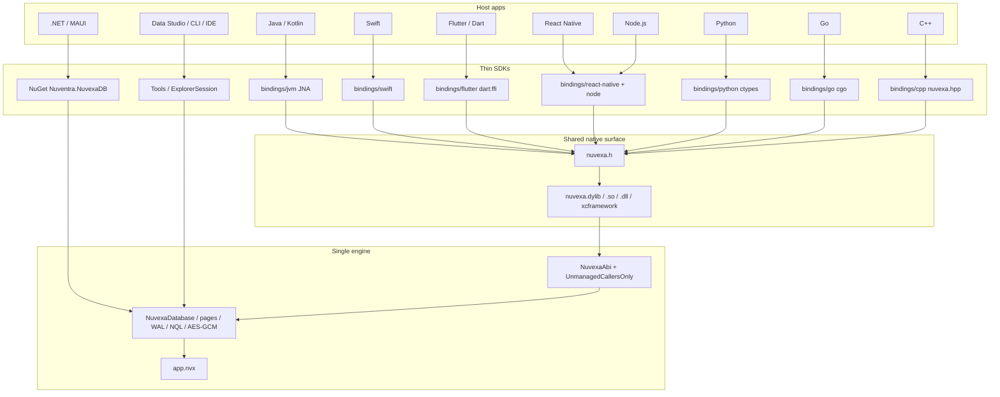

# NuvexaDB engine sharing architecture

How one managed engine serves .NET, MAUI, Java, Kotlin, Swift, Flutter, React Native, Python, Node, Go, and C++. Companion pages: [bindings.md](bindings.md) (SDK how-to), [format.md](format.md), [encryption.md](encryption.md), [query.md](query.md).

## Decision

**One engine, one C ABI, many thin SDKs.** Storage, WAL, BSON, NQL, Argon2, and AES-256-GCM exist only in `Nuventra.NuvexaDB`. Other languages do not reimplement the file. They load a Native AOT build of that engine and pass UTF-8 JSON.

A `.nvx` written from Kotlin is the same file Explorer, Swift, Flutter, and a MAUI app open. Compatibility is a compile of one codebase, not a format treaty between ports.

## Non-goals

- A network server or multi-process writer. One process holds `FileShare.None` on a path.
- A second engine in Kotlin, Swift, Dart, or C++.
- LINQ / `GetCollection<T>` outside .NET.
- SQLite or RocksDB inside `Nuventra.NuvexaDB`.

## Layers



| Layer | Project | Role |
| --- | --- | --- |
| Engine | `src/Nuventra.NuvexaDB` | Pages, catalog, B+tree, NQL, encryption. Public .NET API. |
| C ABI | `src/Nuventra.NuvexaDB.Native` | Handle table + `nuvexa_*` exports. No storage of its own. |
| Tools / IDE | `Tools`, `Explorer`, `Cli`, VS / VS Code | Same engine, desktop UX. |
| Language SDKs | `bindings/*` | Marshal JSON and errors. Must not parse pages. |

.NET hosts skip the C ABI and reference the engine assembly. Everyone else links the AOT library that **contains** that assembly.

## Why Native AOT (not a rewrite, not a sidecar)

| Approach | Why it was rejected or chosen |
| --- | --- |
| Port the engine per language | Format drift on HMAC, Argon2 params, index keys (`s:` / `n:` / `b:`). |
| Wrap the `nuvexa` CLI | Process spawn, no in-process transactions, unusable on mobile. |
| Embed the full .NET runtime | Larger, slower start, harder to ship as an AAR / xcframework. |
| **Native AOT shared library** | One compile per RID. C symbols. In-process. Same fail-closed rules. |

`PublishAot=true` and `NativeLib=Shared` produce `nuvexa.dylib` / `libnuvexa.so` / `nuvexa.dll`. Android JNI uses the Bionic RID `linux-bionic-arm64` (not `android-arm64`). iOS stays on `net10.0` with `PublishAotUsingRuntimePack=true` and a shared dylib wrapped as `Nuvexa.xcframework` (`ios-arm64` + `iossimulator-arm64`). Do not retarget the Native project to `net10.0-ios` (that restore path hits `NETSDK1203`).

The engine uses `System.Text.Json`. The native project sets `JsonSerializerIsReflectionEnabledByDefault` so NQL and index JSON keep working after trim. Do not turn that off.

## ABI contract

Canonical header: [nuvexa.h](../src/Nuventra.NuvexaDB.Native/include/nuvexa.h).

- **In-process handle.** `nuvexa_create` / `nuvexa_open` return an `intptr_t`. The SDK does not hold a file descriptor of its own.
- **JSON in, JSON out.** Insert / replace take a document object. `nuvexa_execute` takes NQL and returns a JSON array. Index fields are a JSON string or array.
- **No exceptions across the boundary.** Status: `0` ok, `1` error, `2` encryption, `3` integrity, `4` not found. Message via `nuvexa_last_error`. Free every `char*` with `nuvexa_free`.
- **Calling convention.** `cdecl`. UTF-8. Null key means unencrypted create / open (encrypted open then returns `NUVEXA_ENCRYPTION`).

```text
Host SDK                         C ABI                         Engine
---------                        -----                         ------
create(path, key)      →  nuvexa_create          →  NuvexaDatabase.Create
insert(col, json)      →  nuvexa_insert          →  GetCollection.InsertAsync
execute(nql)           →  nuvexa_execute         →  ExecuteAsync
close()                →  nuvexa_close           →  Dispose
```

ABI **v2** adds catalog, count, stats, backup / compact / restore, rekey, transactions, and path-based GridFS. LINQ and fluent `Find` stay on the .NET API. Language SDKs must not grow a second query parser.

## What is shared

| Concern | Shared by |
| --- | --- |
| On-disk format v2 (v1 files stay readable; numeric `d:` keys; WAL v2 header) | Every host |
| Encryption (Argon2id KEK, AES-256-GCM DEK, HMAC) | Every host |
| NQL text and operators | `ExecuteAsync` / `nuvexa_execute` |
| Exclusive lock, one writer, concurrent reads | Engine handle |
| Fail-closed open (missing / wrong key) | `NuvexaEncryptionException` / status `2` |
| Integrity refuse (CRC / GCM / HMAC) | `NuvexaIntegrityException` / status `3` |
| Golden NQL cases | [tests/interop/cases.json](../tests/interop/cases.json) |

Host-specific: how the library is loaded (JNA, `dart:ffi`, Swift module map, koffi, `NativeModules`), and whether the public API is sync (Dart, Kotlin, Swift) or async (React Native).

## Platform map

| Host | Path to the engine | Binary it loads |
| --- | --- | --- |
| .NET / MAUI | `PackageReference` / project reference | Managed IL (or the app’s own AOT) |
| Data Studio, CLI, VS, VS Code | `ExplorerSession` → engine | Same |
| Java / Kotlin desktop | JNA → `nuvexa_*` | `nuvexa.dylib` / `.so` / `.dll` |
| Android Kotlin / Java | Same Kotlin types + `jniLibs` | `libnuvexa.so` |
| Swift | `nuvexa.h` | desktop dylib, or `Nuvexa.xcframework` on iOS |
| Flutter | `dart:ffi` (`DynamicLibrary.process()` on iOS) | same library |
| React Native | iOS: ObjC++ → header; Android: Kotlin SDK; Node tests: koffi | same library |
| Python | ctypes → `nuvexa_*` | same library |
| Node.js | `@nuventra/nuvexadb-node` (koffi) | same library |
| Go | cgo → `nuvexa.h` | same library |
| C++ | `nuvexa.hpp` RAII | same library |

Two hosts must not open the same path at once (Explorer + app, or two JNI handles). That is an engine rule, not an SDK bug.

## Publish and ship

```text
src/Nuventra.NuvexaDB          (engine)
        │
        ▼
src/Nuventra.NuvexaDB.Native   (exports)
        │
        ▼
publish.sh  -r <rid>           (one native binary per RID)
        │
        ├─ artifacts/native/osx-arm64/nuvexa.dylib
        ├─ …/win-x64/nuvexa.dll
        ├─ …/win-arm64/nuvexa.dll
        ├─ …/linux-x64/libnuvexa.so
        ├─ …/linux-arm64/libnuvexa.so
        ├─ …/android-arm64/libnuvexa.so   → AAR jniLibs (published as linux-bionic-arm64)
        └─ …/ios/Nuvexa.xcframework       ← ios-arm64 + iossimulator-arm64 dylibs
```

Unix consumers also look for `libnuvexa.*`. The publish script symlinks `nuvexa.dylib` → `libnuvexa.dylib` when Native AOT omits the `lib` prefix.

CI uploads desktop native artifacts, the Bionic Android `.so`, `Nuvexa.xcframework`, and language SDK packs. nuget.org / GitHub Packages push is commented out for now. Do not `dotnet nuget push`, `npm publish`, or `dart pub publish` from a local clone.

## Testing the shared engine

1. C# `InteropFixtureTests` — managed `NuvexaDatabase` and in-process `NuvexaAbi` (same cases, no dylib required).
2. Language SDKs — load `NUVEXA_NATIVE_LIB` / `NUVEXA_NATIVE_DIR` and run [tests/interop/cases.json](../tests/interop/cases.json): encrypted create, insert, indexes, NQL, fail-closed open without a key. Every native / SDK pack job runs those cases (or `abi_runner.c`) before it uploads.
3. Samples — .NET `samples/Console`, `Maui`, `Avalonia`, `Wpf`, `WinUI`, `Uno` (each has its own `.sln`; not in `NuvexaDB.sln`), and each binding’s in-tree example do create / NQL / fail-closed open.

If a host disagrees on `expectNames`, the bug is in that SDK’s marshalling, not a second query engine.

## Adding a platform

1. Do not fork `PageStore`, WAL, or `KeyDerivation`.
2. Call [nuvexa.h](../src/Nuventra.NuvexaDB.Native/include/nuvexa.h) (or reuse an existing SDK that already does).
3. Pass through NQL and document JSON unchanged.
4. Map status `2` / `3` to encryption / integrity errors.
5. Pass the interop fixture file.
6. Document the loader env var and the RID you ship. Update this page and [bindings.md](bindings.md).

## Related

- [bindings.md](bindings.md) — SDK install and API snippets
- [format.md](format.md) — `.nvx` layout (bindings treat the file as opaque)
- [encryption.md](encryption.md) — fail-closed key hierarchy
- [query.md](query.md) — NQL
- [changelog.md](changelog.md) — unreleased engine and binding notes
