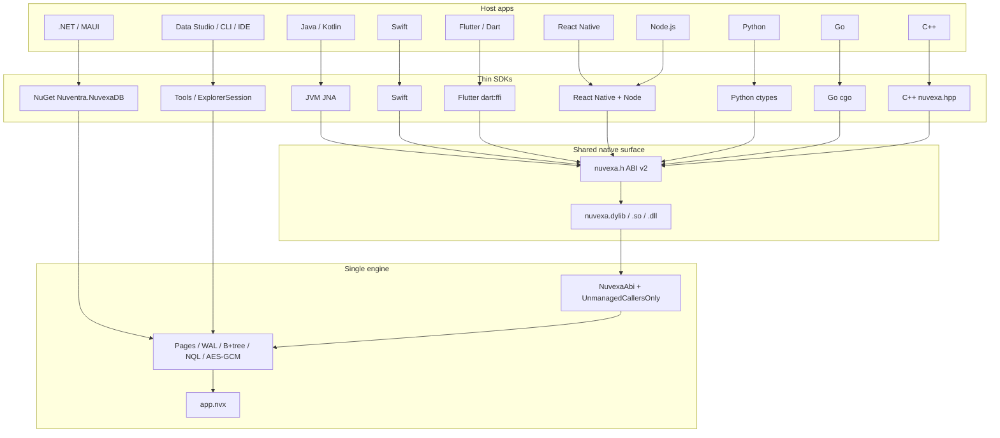

# NuvexaDB White Paper

**Embedded NoSQL database — one engine, one `.nvx` file, many hosts**

| | |
| --- | --- |
| **Product** | NuvexaDB (`Nuventra.NuvexaDB`) |
| **Version** | 1.0.6 |
| **Author** | Niladri Prasad Padhy / Nuventra |
| **License** | MIT |
| **Repository** | https://github.com/nuvyntralabs/NuvexaDB |
| **Release downloads** | https://github.com/nuvyntralabs/NuvexaDB/releases |
| **Date** | 15 September 2026 |

This paper describes the **core engine**, on-disk architecture, security model, performance contract, how platform libraries are produced, the desktop and editor tools, and the 1.x roadmap. Companion pages hold the byte-level and API inventories: [format.md](format.md), [architecture.md](architecture.md), [bindings.md](bindings.md), [Integration/README.md](Integration/README.md), [query.md](query.md), [benchmarks.md](benchmarks.md), [explorer.md](explorer.md).

---

## 1. Abstract

NuvexaDB is an **embedded NoSQL database** for applications that need collections, **NQL** (Nuvexa Query Language), optional **AES-256-GCM** encryption, and a single portable file (`.nvx`). It is not a network server. One process holds an exclusive lock on a path. Concurrent reads on that handle are allowed; writes stay exclusive.

There is **one managed engine**. .NET and .NET MAUI call it directly. Java, Kotlin, Swift, Flutter, React Native, Python, Node.js, Go, and C++ load a **Native AOT** build of the same engine through a C ABI (`nuvexa.h`, ABI v2). A file written from Kotlin is the same file Nuvexa Data Studio, a MAUI app, and a Swift host open. Compatibility is a compile of one codebase, not a format treaty between language ports.

NuvexaDB is a **standalone product**. It ships its own engine, C ABI, language SDKs, Data Studio, CLI, and editor extensions. Hosts compose it with whatever else they already use; that is outside this paper.

---

## 2. Product layers

| Layer | Project | Role |
| --- | --- | --- |
| **Database core** | `src/Nuventra.NuvexaDB` (`Engine`, `Encryption`, `Query`) | Pages, WAL, B+tree, AES-256-GCM, filters, aggregation |
| **Access library** | `Nuventra.NuvexaDB` | `NuvexaDatabase` / `NuvexaCollection` / `AddNuvexaDB` |
| **Nuvexa Data Studio** | `Nuventra.NuvexaDB.Explorer` | Avalonia desktop workbench (Windows x64 / ARM, macOS Apple Silicon / Intel, Linux x64 / ARM64) |
| **Editor extensions** | `Nuventra.NuvexaDB.VSCode`, `Nuventra.NuvexaDB.VisualStudio` | Custom editor / tool window over the same `ExplorerSession` |
| **CLI** | `Nuventra.NuvexaDB.Cli` (`nuvexa`) | `browse` / `samples` / `explain` / `backup` / `restore` (VS Code uses these) |
| **C ABI** | `Nuventra.NuvexaDB.Native` | Native AOT shared library. JSON in, JSON out |
| **Language SDKs** | `bindings/*` | Thin overlays over `nuvexa.h`. They must not parse pages |

Supporting: `Nuventra.NuvexaDB.Tools` (session + disposable explorer grid cache). The engine never embeds another database; the `.nvx` file is the store.



---

## 3. Core engine architecture

### 3.1 Design decisions

The engine is **pure managed C#**. It does not embed SQLite or RocksDB. Storage, WAL, BSON, NQL, Argon2id, and AES-256-GCM exist only in `Nuventra.NuvexaDB`. Other languages do not reimplement the file.

Rejected alternatives for non-.NET hosts:

| Approach | Why it was rejected |
| --- | --- |
| Port the engine per language | Format drift on HMAC, Argon2 parameters, and index keys (`s:` / `n:` / `b:`) |
| Wrap the `nuvexa` CLI | Process spawn, no in-process transactions, unusable on mobile |
| Embed the full .NET runtime | Larger, slower start, harder to ship as an AAR / xcframework |
| **Native AOT shared library** | One compile per RID. C symbols. In-process. Same fail-closed rules |

`PublishAot=true` and `NativeLib=Shared` produce `nuvexa.dylib` / `libnuvexa.so` / `nuvexa.dll`. The native project keeps `JsonSerializerIsReflectionEnabledByDefault` so NQL and index JSON survive trim. That switch must stay on.

### 3.2 Storage model

Mental model for tools and hosts: **collection = table**, **document = JSON row**, **field = column**. `_id` is always the primary key. Declared types live in the hidden collection `__nuvexa_schema` (hidden from the Data Studio tree and from user-facing stats).

On disk, new data-page payloads are **BSON**. Public APIs stay JSON (`NuvexaDocument.Parse` / `ToJson`, NQL, Explorer, C ABI). A payload that looks like `{…}` is treated as legacy UTF-8 JSON. Mixed BSON/JSON files are valid. Existing 1.0.0 files remain readable.

Documents larger than one page are chained. Maximum document size is **16 MiB**. Collection names are at most **120 bytes**.

### 3.3 Page store and catalog

Physical page size is **8192 bytes**. Encrypted pages lose 28 bytes to a random nonce and GCM tag, leaving **8164 bytes** of logical payload. Page 0 is the superblock (never page-encrypted). The catalog lives on page id `1`. Allocatable pages start at id `2`.

Each allocated page (except the superblock) is a slotted buffer:

| Page type | Role |
| --- | --- |
| `Free` | Reusable |
| `Super` | Page 0 only |
| `Catalog` | Collection metadata |
| `Data` | Document slots |
| `IndexLeaf` / `IndexInternal` | B+tree |
| `SecondaryIndexCatalog` | Secondary index directory |

Slots grow from the header; the slot directory grows backward from the end of the logical page. Page header fields include type, item count, CRC32 of the logical page, page id, LSN, next-page (overflow / chain), and right sibling (B+tree).

### 3.4 Write-ahead log

Companion file: `<path>.nvx-wal`, magic `NVXW`.

| Record | Contents |
| --- | --- |
| Page (`type 1`) | Page id, LSN, 8192-byte physical page, CRC32 of that page |
| Commit (`type 2`) | LSN, CRC32 of type + LSN |

Replay applies page records up to the last valid commit, then truncates after a successful checkpoint. Encrypted checkpoints write the same DEK HMAC on WAL copies of page 0. Legacy all-zero MAC records still replay.

Crash contract (enforced in CI by `tests/Nuventra.NuvexaDB.CrashHarness`): a committed insert survives `Environment.FailFast`.

### 3.5 Indexes

Secondary indexes are B+trees. Keys are UTF-8 with a type prefix, a NUL, and the document id:

| Prefix | Meaning |
| --- | --- |
| `s:` | string |
| `n:` | v1 number (`G17` invariant culture — **not** numeric-order-preserving) |
| `d:` | v2 number (8 IEEE754 sortable bytes — lex order = numeric order) |
| `b:0` / `b:1` | boolean |
| `z:` | null |
| `j:` | other JSON |

Compound indexes join field paths and value prefixes with U+001F (`EnsureIndexAsync(["city", "status"])`).

**IXSCAN** covers:

- Equality (single-field or compound prefix)
- String ranges
- Compound equality on the indexed prefix

On **format v2** files, numeric `$gte` / `$lte` use bounded IXSCAN (`d:` keys). **v1** files still walk the `n:` G17 index and apply the real compare. `explain()` reports `ID`, `IXSCAN`, `COLLSCAN`, `AGGREGATE`, `UPDATE`, or `DELETE`.

Indexed `find` does not materialize the whole secondary index before `skip` / `limit`. Equality and string ranges use B+tree `lo` / `hi` (prefix inclusive, successor exclusive). Without `sort`, `skip` / `limit` apply while scanning. With `sort` on a non-index field, matches are collected then sorted.

### 3.6 Concurrency, lock, and transactions

- **One process, one path.** `FileShare.None`. A second `Open` / `Create` on the same path throws.
- **One writer, concurrent readers** on an open handle. Page cache and file I/O are locked.
- **`BeginTransactionAsync`** checkpoints first so abort can restore the last durable snapshot.
- **`await using` without `CommitAsync` rolls back** (implicit commit was removed). Callers that already `CommitAsync` are unchanged.
- **`CompactAsync`** streams documents in 256-row batches, preserves encryption, swaps the file in place, and **keeps the handle open**.
- **`BackupAsync`** checkpoints and copies through the open stream (it does not `File.Copy` a locked file). **`RestoreAsync`** / `nuvexa restore` replace the file.

`$lookup` refuses a foreign collection larger than `LookupMaxDocuments` (default **100 000**; `0` disables the cap). Limits are public on `NuvexaLimits`.

### 3.7 NQL and the .NET query surface

NQL is the shared query language for Data Studio, `NuvexaDatabase.ExecuteAsync`, `nuvexa query`, and `nuvexa_execute`.

```text
db.<collection>.find({ ... }).sort({ field: 1 }).skip(n).limit(n).page(p, size).project({ field: 1 })
db.<collection>.aggregate([ ... ])
db.<collection>.update({ ... }, { $set: { ... } })
db.<collection>.delete({ ... })
```

Unquoted JS keys are accepted (`age: { $gte: 21 }` → valid JSON). `.page(2, 200)` is the same as `.skip(200).limit(200)`.

| Find operators | `$eq $ne $gt $gte $lt $lte $in $nin $and $or $exists $regex` |
| Updates | `$set $unset $inc $push $pull` (NQL `update` / library `UpdateAsync`) |
| Aggregate stages | `$match $project $sort $skip $limit $count $group $lookup` |
| `$group` accumulators | `$sum $min $max $avg $first` |

Aggregation runs in memory after a collection scan. Do not `$lookup` into a multi-million-row foreign collection.

**.NET only:** fluent `NuvexaFilter`, typed `GetCollection<T>()`, and LINQ via an AOT-safe expression visitor (`ExpressionFilter`) — not `IQueryable`. Language SDKs must not grow a second query parser; they pass NQL and document JSON through.

**Files:** `db.Files.UploadAsync` / `DownloadAsync` store chunks in `fs.files` / `fs.chunks`. ABI v2 exposes path-based GridFS (`nuvexa_fs_upload` / `download` / `metadata`), not raw byte buffers.

### 3.8 C ABI contract (v2)

Canonical header: `src/Nuventra.NuvexaDB.Native/include/nuvexa.h`. `nuvexa_abi_version()` returns **2**.

- In-process handle (`intptr_t`). The SDK does not hold its own file descriptor.
- JSON in, JSON out. `nuvexa_execute` returns a JSON array.
- No exceptions across the boundary. Status: `0` ok, `1` error, `2` encryption, `3` integrity, `4` not found.
- `cdecl`, UTF-8. Null key means unencrypted create / open (encrypted open then returns `NUVEXA_ENCRYPTION`).
- Free every `char*` with `nuvexa_free`.

v2 adds catalog, count, stats, backup / compact / restore, rekey, transactions, and path-based GridFS. LINQ and fluent `Find` stay on the .NET API.

Golden NQL cases live in `tests/interop/cases.json`. Every native / SDK pack job runs those cases (or `abi_runner.c`) before it uploads. If a host disagrees on expected names, the bug is in that SDK’s marshalling, not a second query engine.

---

## 4. File format (version 2; format 1 deprecated)

A `.nvx` file is one portable embedded database. **Creates and writes always use format 2** (order-preserving numeric `d:` keys and a 32-byte WAL header that records page size). Format **1** is deprecated and still opens. Language bindings treat the file as **opaque**.

| Item | Value |
| --- | --- |
| Magic (bytes 0–3) | `NVX1` |
| Format version | `2` on every create / write; `1` deprecated, accepted on open (uint16 LE at offset 4) |
| Physical page size | 8192 bytes |
| Logical payload (after GCM) | 8164 bytes |
| Page header | 40 bytes |
| Slot directory entry | 4 bytes (offset + length, uint16 LE) |
| Catalog page id | `1` |
| First allocatable page id | `2` |
| Companion WAL | `<path>.nvx-wal` (`NVXW`) |
| Exclusive lock | `FileShare.None` |

### 4.1 Superblock (page 0, little-endian)

Page 0 is never AES-GCM page-encrypted. Encrypted files HMAC-SHA256 the first 400 bytes with the DEK (32-byte MAC at offset 400). Superblock CRC32 covers those 400 bytes (CRC at offset 198; the CRC field is zeroed while computing).

| Offset | Size | Field |
| --- | --- | --- |
| 0 | 4 | Magic `NVX1` |
| 4 | 2 | Version |
| 6 | 2 | Flags (`Encrypted = 1`, `CompactNeeded = 2`, `IntegrityProtected = 4`) |
| 8 | 4 | Page size (must be 8192) |
| 12 | 8 | Page count |
| 20 | 16 | File id (AAD / wrap nonce context) |
| 36 | 8 | Catalog page id |
| 44 | 8 | Next page id |
| 52 | 8 | Committed LSN |
| 68 | 4 | Argon2id memory KiB |
| 72 | 4 | Argon2id iterations |
| 76 | 2 | Argon2id parallelism |
| 78 | 16 | KDF salt |
| 94 | 12 | Verifier nonce |
| 106 | 16 | Verifier tag |
| 122 | 16 | Verifier ciphertext (`NVEXA-OK-VERIFY!`) |
| 138 | 12 | DEK wrap nonce |
| 150 | 16 | DEK wrap tag |
| 166 | 32 | Wrapped DEK (AES-256-GCM) |
| 198 | 4 | CRC32 of bytes 0–399 |
| 400 | 32 | HMAC-SHA256(DEK, bytes 0–399); all-zero = legacy, still accepted |

Byte-level page layout: [format.md](format.md).

---

## 5. Security

### 5.1 Threat model

NuvexaDB protects **data at rest on one device**. It is a local process over one file. It does not listen on the network and does not register remote users. The threat is a stolen or copied `.nvx` (and, for encrypted files, a guessed passphrase). Integrity checks refuse a tampered file; the engine **does not repair** it.

### 5.2 Fail-closed open

An encrypted file **never** opens without the correct key. Missing or wrong key throws `NuvexaEncryptionException` (C ABI `NUVEXA_ENCRYPTION`). The library does not create, overwrite, or partially open the file. `NuvexaDatabase.IsEncrypted` / `nuvexa_is_encrypted` reads the superblock flag **without** the key so an IDE can prompt first.

A tampered or corrupt file throws `NuvexaIntegrityException` (C ABI `NUVEXA_INTEGRITY`) and is not opened. Data Studio, Visual Studio, and VS Code / Cursor surface that as an alert (they do not rewrite the file).

### 5.3 Key hierarchy

1. **Passphrase** — UTF-8, supplied by the host. Never stored in the `.nvx`, in source, or in Data Studio recent-file / query-history JSON.
2. **KEK** — Argon2id, 32 bytes. Memory, iterations, parallelism, and a 16-byte salt live in the superblock.
   - Memory: 8–256 MiB (app `Create()` default **16 MiB**, mobile-safe; Explorer / CLI `ForDesktop` uses **64 MiB**)
   - Iterations: 1–16 (default 3)
   - Parallelism: 1–8 (default 2)
   - Existing files keep the KDF parameters stored at create time.
3. **DEK** — 32 random bytes. Wraps the page cipher. Wrapped with AES-256-GCM under the KEK; AAD is the 16-byte file id.
4. **Verifier** — plaintext `NVEXA-OK-VERIFY!` encrypted with the KEK (same AAD). Wrong passphrase fails here **before pages are touched**.

`ChangeEncryptionKey` / `nuvexa_change_encryption_key` **re-wraps the existing DEK**. Pages are not rewritten.

The host supplies the passphrase. Data Studio does **not** write it to the OS keychain (see roadmap). Weak demo keys (`1234`) are a passphrase problem, not a leaked product secret.

### 5.4 Page cipher and integrity

Every allocated page except the superblock:

| Bytes | Content |
| --- | --- |
| 0–11 | Random nonce |
| 12–27 | GCM tag (16 bytes) |
| 28–8191 | Ciphertext of the 8164-byte logical page |

AAD is file id (16 bytes) + page id (int64 LE). A tag mismatch is fail-closed.

Open path:

1. Read page 0. Reject missing `NVX1`, bad CRC, or unsupported version / page size.
2. If encrypted and the key is missing or empty → `NuvexaEncryptionException`.
3. Derive KEK, verify the verifier, unwrap the DEK.
4. Verify HMAC when it is not all zeros.
5. Replay WAL. Optionally scan allocated pages (CRC32; AES-GCM when encrypted).

`NuvexaOpenOptions.VerifyIntegrity` defaults to **true**. Full page scan is skipped when the file is larger than `IntegrityScanMaxBytes` (default **64 MiB**; `0` always scans). Superblock checks still run. A bad page still fails when it is first read.

Bindings must **not** implement Argon2 or AES. They pass the passphrase into `nuvexa_create` / `nuvexa_open`.

---

## 6. Performance

NuvexaDB is an embedded page store, not a client/server cluster. Performance is measured against **SQLite** (`Microsoft.Data.Sqlite`) and **LiteDB** on the same machine, plus frozen SLOs in CI.

### 6.1 Query path (what is fast)

| Workload | Engine behavior |
| --- | --- |
| Point get by `_id` | Primary key |
| Equality / string-range `find` + `limit` | **IXSCAN**, bounded prefix — stops after the limit |
| Compound equality on an indexed prefix | **IXSCAN** |
| Numeric range (`age >= 21`) | Walks the `n:` index, real compare — correct, not order-preserving |
| `find` + `sort` on a non-index field | Collect, then sort |
| Aggregation / `$lookup` | In-memory after a collection scan; `$lookup` cap 100 000 foreign docs |

Create a secondary index (`EnsureIndexAsync`) for the fields you filter on. Indexed equality + early `limit` is the intended “first page of a large collection” path (Data Studio browse is 200 rows).

### 6.2 Frozen v1 SLOs (`--gate`, every CI OS)

```bash
dotnet run --project benches/Nuventra.NuvexaDB.Benchmarks -c Release -- --gate
```

| Gate | Rule |
| --- | --- |
| Smoke (1 000 inserts) | Fail if NuvexaDB is more than **5×** slower than **both** SQLite and LiteDB |
| Batch insert 10k | Within **1.5×** LiteDB |
| Encrypted point get (cache-hot, median of 3) | ≤ **30%** slower than plaintext, or within +50 ms (Windows CI noise floor on sub-20 ms totals) |
| Point get @ 100k docs (2 000 lookups) | Within **3×** SQLite primary key |
| Crash recovery | Committed insert survives `Environment.FailFast` |

### 6.3 Local scale (not CI)

`--crore` writes 10 million documents (`~/Downloads/nuvexa-1crore.nvx`). It can take hours and several GB. `--scale N` is the smaller local run.

Measured on the author’s machine (13 September 2026), **1 000 customers**:

| Step | Result |
| --- | --- |
| `InsertMany` 1 000 | 93 ms (~10 800 docs/s) |
| Index city / status / age | 39 / 19 / 19 ms |
| Point-get × 1 000 | 6 ms |
| `city = Bengaluru` limit 50 | 1 ms, **IXSCAN examined = 50** |
| city + status + age limit 50 | 1 ms, 22 rows |

An earlier 1-crore run: write ~5.5 min. Compound `city+status+age` limit 50 was a **38 s collection scan** before the find-path change. Re-run `--crore` without `--force` to measure IXSCAN on that file.

Encryption cost is dominated by Argon2id at **open / create**, then per-page AES-GCM. Cache-hot point gets stay inside the +30% SLO versus plaintext.

---

## 7. Releasing platform-specific libraries — the logic

### 7.1 Why one engine is compiled per RID

The on-disk format, KDF, and NQL must be identical everywhere. The only portable way to guarantee that is **one source tree** compiled to:

1. **Managed IL** for .NET / MAUI / Data Studio / CLI / VS / VS Code (`ExplorerSession` → engine).
2. **Native AOT shared libraries** for every other language, one **RID** (Runtime Identifier) per OS/CPU.

```text
src/Nuventra.NuvexaDB          (engine)
        │
        ▼
src/Nuventra.NuvexaDB.Native   (nuvexa_* exports)
        │
        ▼
publish.sh  -r <rid>           (one native binary per RID)
        │
        ├─ osx-arm64 / nuvexa.dylib     Apple Silicon
        ├─ osx-x64   / nuvexa.dylib     Intel Mac
        ├─ win-x64   / nuvexa.dll
        ├─ win-arm64 / nuvexa.dll
        ├─ linux-x64 / libnuvexa.so
        ├─ linux-arm64 / libnuvexa.so
        └─ linux-bionic-arm64 / libnuvexa.so   → Android AAR jniLibs
```

Unix consumers also look for `libnuvexa.*`. The publish script symlinks `nuvexa.dylib` → `libnuvexa.dylib` when Native AOT omits the `lib` prefix.

A Kotlin host on Apple Silicon must not load the Intel dylib. That is why CI **does not** ship a single “universal” blob for every language: each job publishes the library that the runner can **link and test**.

### 7.2 Why these RIDs (and not others)

| RID | Ships | Logic |
| --- | --- | --- |
| `osx-arm64` | Native ABI, Data Studio `.pkg`, most language SDKs, Swift | Current Mac CI runner (`macos-latest`) is Apple Silicon. First-class desktop RID. |
| `osx-x64` | Native ABI, Data Studio `.pkg` | Intel Mac still exists. Cross-compiled on the same macOS runner so Intel users get a native binary, not Rosetta-only hope. |
| `win-x64` | Native ABI, Data Studio `.msi`, JVM / Python / Node | Windows desktop and Visual Studio. |
| `win-arm64` | Native ABI, Data Studio `.msi` | Snapdragon / Windows on ARM. Built and tested on `windows-11-arm`. |
| `linux-x64` | Native ABI, `.deb` + `.rpm`, JVM / Python / Node / Go / C++ / Flutter / RN JS | Linux desktop / CI / servers. |
| `linux-arm64` | Native ABI, `.deb` (`arm64`) + `.rpm` (`aarch64`) | Raspberry Pi / ARM servers. Built and tested on `ubuntu-24.04-arm`. |
| `linux-bionic-arm64` | `NuvexaDB-Native-android-arm64` | Android JNI. Native AOT **cannot** target `android-arm64`. Bionic is the libc Android actually loads. NDK on `PATH`. |
| `ios-arm64` + `iossimulator-arm64` | `NuvexaDB-Native-iOS` (`Nuvexa.xcframework`) | Stay on `net10.0` and set `PublishAotUsingRuntimePack`. Do not retarget to `net10.0-ios`. Device + simulator shared libs are packed with `xcodebuild -create-xcframework`. |

Desktop and server RIDs ship from native CI runners that can link and test that ABI. Mobile follows the ABI the OS can actually load.

**In short:** official CI today is Apple Silicon Mac, Intel Mac, Windows x64, Windows ARM (`windows-11-arm` → `nuvexa.dll` + Data Studio MSI), Linux x64, Linux ARM (`ubuntu-24.04-arm` → `libnuvexa.so` + `.deb` / `.rpm`), Android (`linux-bionic-arm64`), and iOS (`Nuvexa.xcframework`). Language SDK packs still run on x64 / Apple Silicon hosts and load the matching native artifact.

### 7.3 Why language SDKs are thin

Each SDK only:

- Loads the RID-matched library (JNA, `dart:ffi`, Swift module map, koffi, ctypes, cgo, `nuvexa.hpp`).
- Marshals UTF-8 JSON and maps status `2` / `3` to encryption / integrity errors.
- Runs `tests/interop/cases.json`.

They must not parse pages, implement Argon2, or invent a second query language. A `.nvx` is compatible because **the same engine wrote it**.

Host-specific only: loader (`NUVEXA_NATIVE_LIB` / `NUVEXA_NATIVE_DIR` / `jniLibs` / `DynamicLibrary.process()` on iOS) and whether the public API is sync (Dart, Kotlin, Swift) or async (React Native, to match `NativeModules`).

### 7.4 One product version

Every shippable surface shares `<Version>` / `<PackageVersion>` in `Directory.Build.props`. After a bump:

```bash
python3 .github/scripts/check-versions.py --repo-root . --write
```

That copies the same number onto NuGet metadata, Java, Android (`versionName` + `versionCode` = major×10000 + minor×100 + patch; **1.0.6 → 10006**), Python, Node, React Native, Flutter, Go, C++, Swift, Data Studio installers, VS Code, and Visual Studio. CI **fails** if any of those drift. Sample apps are not bumped.

### 7.5 Two download channels (intentional)

| Channel | When | What the user gets |
| --- | --- | --- |
| **GitHub Actions Artifacts** | Every green `main` / PR | Temporary zips: nupkg, natives, Data Studio installers, VSIX, SDK packs. Expire. **Do not** update [Releases](https://github.com/nuvyntralabs/NuvexaDB/releases). |
| **GitHub Release `v*`** | Tag `v<Version>` **and** every job on that run is green (`if: github.ref_type == 'tag' && success()`) | Permanent zips. Users download only the zip they need. |

Logic:

1. Everyday engineering must not overwrite the public Releases page.
2. A red tag run must not publish a half-built product (`success()` on `publish-release`).
3. Tag and `main` on the **same SHA** share a concurrency group (`${{ github.workflow }}-${{ github.sha }}`). The tag run wins; the duplicate `main` run is cancelled.
4. If a **published** (non-draft) Release `v<Version>` already exists, CI stops after version alignment. Bump `Directory.Build.props` to start a new build.
5. `publish-release` downloads every `NuvexaDB-*` artifact, zips each folder (`stage-release-assets.sh`), and `gh release create` with `--verify-tag`.

nuget.org, GitHub Packages, Maven, npm, pub.dev, PyPI, and Swift Package publish stay **commented out** until multi-host publishing is decided. Do not `dotnet nuget push` (or the equivalent) from a clone.

Language SDK jobs wait for the matching `NuvexaDB-Native-<rid>` artifact, run that SDK’s interop suite, then pack. Android AAR and React Native modules run the golden fixtures before they assemble.

---

## 8. Tools (IDEs and editors)

All tools open **one** `.nvx`. They share `ExplorerSession` (browse filter, 200-row pager, query examples, explain, collection captions). They are not a second engine.

### 8.1 Nuvexa Data Studio (desktop IDE)

Avalonia 11 desktop workbench. Self-contained publish per RID.

| Platform | Installer | CPU |
| --- | --- | --- |
| **Windows x64** | `NuvexaDB-Explorer-*-win-x64.msi` (WiX 5) | x64 |
| **Windows ARM** | `NuvexaDB-Explorer-*-win-arm64.msi` (WiX 5) | arm64 |
| **macOS Apple Silicon** | `NuvexaDB-Explorer-*-osx-arm64.pkg` | arm64 |
| **macOS Intel** | `NuvexaDB-Explorer-*-osx-x64.pkg` | x64 |
| **Linux x64** | `nuvexadb-explorer_*_amd64.deb` / `nuvexadb-explorer-*-x86_64.rpm` | x86_64 |
| **Linux ARM64** | `nuvexadb-explorer_*_arm64.deb` / `nuvexadb-explorer-*-aarch64.rpm` | aarch64 |

macOS notes: the `.pkg` is **unsigned / ad-hoc signed** today and always installs to `/Applications`. Single-file publish is **disabled** on `osx-*` so Avalonia/Skia dylibs sit beside the host inside `Contents/MacOS` (single-file + extracted natives breaks the `.app` + ad-hoc sign). Windows and Linux use a compressed single-file host.

Tabs: **Database Structure**, **Browse Data**, **NQL**. File: New / Open / Open Recent (12 paths, **never** the passphrase) / Close, JSON/CSV import-export. Tools: change key, compact, backup, restore, database properties. View: system / light / dark theme, read-only. Drag a `.nvx` onto the window. Encrypted open prompts for the key; integrity or encryption failure is an alert.

Browse is an editable typed grid (BOOLEAN checkbox, DATETIME picker, cell autosave). That editable grid is **Avalonia-only**.

Local run (development):

```bash
dotnet run --project src/Nuventra.NuvexaDB.Explorer/Nuventra.NuvexaDB.Explorer.csproj -c Release
```

### 8.2 Visual Studio (Windows)

`Nuventra.NuvexaDB.VisualStudio` VSIX: `.nvx` editor factory, WPF tool-window pane, in-process `NuvexaToolWindow`. Browse grid cells are editable (except `_id`). Filter, build filter, find-in-page, JSON/Tree, 200-row pager, and NQL find / aggregate / update / delete. Same About copy (`NuvexaAbout`). Requires the Visual Studio SDK to pack.

### 8.3 VS Code and Cursor (Windows, macOS, Linux)

`Nuventra.NuvexaDB.VSCode` VSIX. Custom editor talks to the engine through the **`nuvexa` CLI** (`browse`, `replace`, `samples`, `explain`, `query`, `tree`, `open` / `close`). Works on the same desktop OSes as the editor host (Windows x64 / ARM, macOS Apple Silicon / Intel, Linux x64 / ARM64). The CLI and native bits must match the machine RID. Browse cells are editable.

| Feature | Data Studio | Visual Studio | VS Code / Cursor |
| --- | --- | --- | --- |
| Open / close encrypted `.nvx` | Yes | Yes | Yes |
| Structure tree + row counts | Yes | Yes | `nuvexa tree` |
| Editable browse grid / schema dialogs | Yes | No | No |
| NQL execute + explain | Yes | Yes | Yes |
| About | Help menu | About tab | About tab + command |

### 8.4 CLI

`nuvexa` is the headless tool: query, browse pages, explain, backup, restore, samples. VS Code is a client of this tool, not a fork of the query planner.

---

## 9. Future roadmap

Items below are **intentional 1.x follow-ons** or documented gaps. Do not treat them as shipped in 1.0.6.

### 9.1 Future (not planned yet)

| Item | Why |
| --- | --- |
| **Signed / notarized macOS Data Studio** | Current `.pkg` is unsigned; Gatekeeper will warn. |
| **OS keychain for the last Data Studio key** | Passphrase is prompted every open; never stored today. |
| **Multi-host package feeds** | Uncomment nuget.org / GitHub Packages (and later Maven, npm, pub.dev, PyPI, Swift Package) when that decision is made. One version number already exists. |

### 9.2 Engine follow-ons (format v2 already shipped)

In-format candidates: more aggregate stages, richer GridFS (byte buffers in the ABI), streaming improvements, tighter `$lookup` planning. LINQ remains .NET-only. Physical page size stays 8192; changing it would need another version.

### 9.4 Explicit non-goals

These stay **out** of the roadmap unless the product definition changes:

- A **network server** or multi-process writer.
- A **second engine** in Kotlin, Swift, Dart, or C++.
- `IQueryable` / a LINQ provider that breaks Native AOT.
- Automatic repair of a corrupt `.nvx`.

---

## 10. Product description

NuvexaDB is an **embedded NoSQL database** for desktop and mobile applications:

- One portable **`.nvx`** file (plaintext or AES-256-GCM).
- **Collections**, BSON documents, secondary indexes, and **NQL** (`find` / `aggregate`). On .NET, fluent filters and typed LINQ are also available.
- **Fail-closed** open: missing key and tamper both refuse the file. The engine does not repair a corrupt `.nvx`.
- **One engine** for every host: NuGet for .NET / MAUI, Native AOT C ABI for Java, Kotlin, Swift, Flutter, React Native, Python, Node.js, Go, and C++.
- **Tools** on the same engine: Nuvexa Data Studio (Windows x64 / ARM, macOS Apple Silicon / Intel, Linux x64 / ARM64), Visual Studio and VS Code / Cursor editors, and the `nuvexa` CLI.

It is not a client/server database. One process holds a path. Combining NuvexaDB with other libraries is a host decision and is not part of this product.

---

## 11. References

| Document | Contents |
| --- | --- |
| [architecture.md](architecture.md) | One engine, one C ABI, platform map |
| [format.md](format.md) | Superblock, pages, WAL, index keys |
| [encryption.md](encryption.md) | KDF, DEK wrap, page GCM, open path |
| [query.md](query.md) | NQL operators, aggregation, LINQ |
| [bindings.md](bindings.md) | SDK snippets, ABI v2 surface |
| [Integration/README.md](Integration/README.md) | Per-host download, project setup, CRUD, encryption password |
| [benchmarks.md](benchmarks.md) | `--gate`, `--crore`, comparators |
| [explorer.md](explorer.md) | Data Studio / VS / VS Code capability inventory |
| [changelog.md](changelog.md) | Engine and IDE notes |
| [README.md](../README.md) | Install, samples, artifact table |
